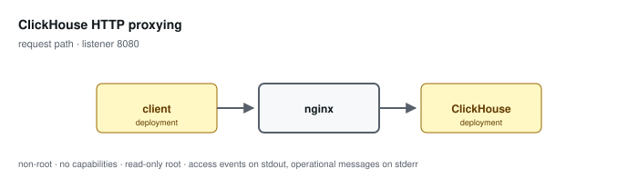

# ClickHouse HTTP proxying

**Status: preview / unqualified.** Tested, not supported. See the
[support matrix](../../SUPPORT.md).

Bounds the shape of a request to the ClickHouse HTTP interface: methods, body size, timeouts, retries, and temporary storage. It is not an authorization boundary.

Configuration: [`examples/profiles/clickhouse/nginx.conf`](../../../examples/profiles/clickhouse/nginx.conf)

## Shared baseline

Like every profile, this one listens on an unprivileged port, exposes an
unlogged `/healthz`, runs as an arbitrary non-root UID in group 0 with all
capabilities dropped and a read-only root, sets `server_tokens off` with
bounded request handling, validates or replaces the inbound correlation
identifier, and emits one JSON access event per application request that
records the path and never the query string.

## What the tests qualify

- a POST body reaches the upstream unchanged
- credentials and query text in the request target reach no log
- an exception code is recorded without the statement that caused it
- methods outside the interface and oversized bodies are refused

## What they do not

- interoperation with a real ClickHouse server
- protocol, version, or query semantics
- compression negotiation and performance on real result sets
- anything depending on query content — that is ClickHouse's to enforce

## Related

- [Profile guide](../../CONFIGURATION-PROFILES.md#clickhouse-http-proxying) — full configuration detail and log schema
- [Profile map](../README.md#configuration-profiles) — how this profile relates to the others
- [Runtime contract](../README.md#runtime-contract) — the boundary every profile inherits
