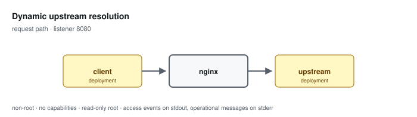

# Dynamic upstream resolution

**Status: preview / unqualified.** Tested, not supported. See the
[support matrix](../../SUPPORT.md).

Re-resolves the upstream per request instead of once at load, for deployments that cannot reload when endpoint addresses change.

Configuration: [`examples/profiles/dynamic-upstream/nginx.conf`](../../../examples/profiles/dynamic-upstream/nginx.conf)

## Shared baseline

Like every profile, this one listens on an unprivileged port, exposes an
unlogged `/healthz`, runs as an arbitrary non-root UID in group 0 with all
capabilities dropped and a read-only root, sets `server_tokens off` with
bounded request handling, validates or replaces the inbound correlation
identifier, and emits one JSON access event per application request that
records the path and never the query string.

## What the tests qualify

- a request is served with its path intact
- a replaced endpoint at a new address recovers without a reload

## What they do not

- balancing, failure tracking, failover, and connection reuse — all given up with the upstream block
- resolver failure modes
- behaviour when DNS returns several addresses
- recovery time against any particular zone's TTL

## Related

- [Profile guide](../../CONFIGURATION-PROFILES.md#upstream-resolution-static-by-default-dynamic-by-choice) — full configuration detail and log schema
- [Profile map](../README.md#configuration-profiles) — how this profile relates to the others
- [Runtime contract](../README.md#runtime-contract) — the boundary every profile inherits
