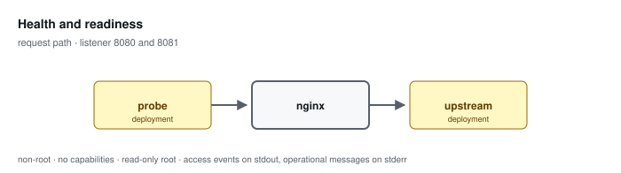

# Health and readiness

**Status: preview / unqualified.** Tested, not supported. See the
[support matrix](../../SUPPORT.md).

Separates liveness, readiness, and an operator status surface. Liveness never consults the upstream; readiness does.

Configuration: [`examples/profiles/health/nginx.conf`](../../../examples/profiles/health/nginx.conf)

## Shared baseline

Like every profile, this one listens on an unprivileged port, exposes an
unlogged `/healthz`, runs as an arbitrary non-root UID in group 0 with all
capabilities dropped and a read-only root, sets `server_tokens off` with
bounded request handling, validates or replaces the inbound correlation
identifier, and emits one JSON access event per application request that
records the path and never the query string.

## What the tests qualify

- liveness answers while the upstream is stopped
- readiness reports 503 and records a structured event
- the status surface refuses an unlisted source even when published
- a succeeding probe writes no access event

## What they do not

- probe interval and threshold tuning for any orchestrator
- startup-probe behaviour
- the status surface under an approved allow-list

## Related

- [Profile guide](../../CONFIGURATION-PROFILES.md#extended-health-and-readiness-endpoints) — full configuration detail and log schema
- [Profile map](../README.md#configuration-profiles) — how this profile relates to the others
- [Runtime contract](../README.md#runtime-contract) — the boundary every profile inherits
