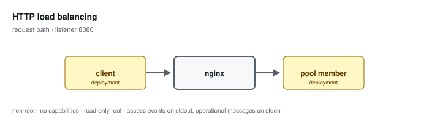

# HTTP load balancing

**Status: preview / unqualified.** Tested, not supported. See the
[support matrix](../../SUPPORT.md).

Distributes across a pool with weighted round robin, passive member failure handling, and bounded retries that never cover non-idempotent methods.

Configuration: [`examples/profiles/load-balancer/nginx.conf`](../../../examples/profiles/load-balancer/nginx.conf)

## Shared baseline

Like every profile, this one listens on an unprivileged port, exposes an
unlogged `/healthz`, runs as an arbitrary non-root UID in group 0 with all
capabilities dropped and a read-only root, sets `server_tokens off` with
bounded request handling, validates or replaces the inbound correlation
identifier, and emits one JSON access event per application request that
records the path and never the query string.

## What the tests qualify

- every healthy member receives traffic
- losing a member causes no client-visible failure
- at least one retry is recorded, proving the dead member was tried

## What they do not

- capacity and latency under load
- connection draining during a rolling member restart
- session affinity
- active health checking — not available in open source NGINX

## Related

- [Profile guide](../../CONFIGURATION-PROFILES.md#http-load-balancing) — full configuration detail and log schema
- [Profile map](../README.md#configuration-profiles) — how this profile relates to the others
- [Runtime contract](../README.md#runtime-contract) — the boundary every profile inherits
