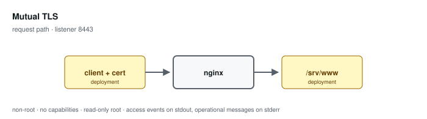

# Mutual TLS

**Status: preview / unqualified.** Tested, not supported. See the
[support matrix](../../SUPPORT.md).

Requires a client certificate issued by a mounted authority, and enforces a mounted revocation list.

Configuration: [`examples/profiles/mutual-tls/nginx.conf`](../../../examples/profiles/mutual-tls/nginx.conf)

## Shared baseline

Like every profile, this one listens on an unprivileged port, exposes an
unlogged `/healthz`, runs as an arbitrary non-root UID in group 0 with all
capabilities dropped and a read-only root, sets `server_tokens off` with
bounded request handling, validates or replaces the inbound correlation
identifier, and emits one JSON access event per application request that
records the path and never the query string.

## What the tests qualify

- a valid client certificate is accepted
- an untrusted client certificate is rejected
- a revoked client certificate is rejected
- client certificate identity is not logged

## What they do not

- certificate authority operation and client enrolment
- OCSP or any revocation check beyond a mounted CRL
- CRL freshness — a stale list silently re-admits a revoked client

## Related

- [Profile guide](../../CONFIGURATION-PROFILES.md) — full configuration detail and log schema
- [Profile map](../README.md#configuration-profiles) — how this profile relates to the others
- [Runtime contract](../README.md#runtime-contract) — the boundary every profile inherits
