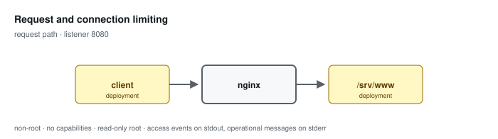

# Request and connection limiting

**Status: preview / unqualified.** Tested, not supported. See the
[support matrix](../../SUPPORT.md).

Applies three independent budgets: request rate, concurrent connections, and per-connection bandwidth. Rejections answer 429.

Configuration: [`examples/profiles/rate-limited/nginx.conf`](../../../examples/profiles/rate-limited/nginx.conf)

## Shared baseline

Like every profile, this one listens on an unprivileged port, exposes an
unlogged `/healthz`, runs as an arbitrary non-root UID in group 0 with all
capabilities dropped and a read-only root, sets `server_tokens off` with
bounded request handling, validates or replaces the inbound correlation
identifier, and emits one JSON access event per application request that
records the path and never the query string.

## What the tests qualify

- exhausting the rate budget answers 429, recorded as rejected
- exceeding the connection budget is rejected by that limit specifically
- the health endpoint answers while the request budget is exhausted

## What they do not

- tuning for any particular workload
- zone sizing against real client populations
- behaviour once a zone is exhausted
- interaction with an upstream rate limiter

## Related

- [Profile guide](../../CONFIGURATION-PROFILES.md#request-rate-and-connection-limiting) — full configuration detail and log schema
- [Profile map](../README.md#configuration-profiles) — how this profile relates to the others
- [Runtime contract](../README.md#runtime-contract) — the boundary every profile inherits
