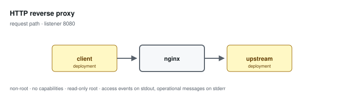

# HTTP reverse proxy

**Status: preview / unqualified.** Tested, not supported. See the
[support matrix](../../SUPPORT.md).

Forwards to one explicit HTTP upstream with reviewed headers. Replaces any client-supplied forwarding chain with the direct peer address and performs no retry.

Configuration: [`examples/profiles/reverse-proxy/nginx.conf`](../../../examples/profiles/reverse-proxy/nginx.conf)

## Shared baseline

Like every profile, this one listens on an unprivileged port, exposes an
unlogged `/healthz`, runs as an arbitrary non-root UID in group 0 with all
capabilities dropped and a read-only root, sets `server_tokens off` with
bounded request handling, validates or replaces the inbound correlation
identifier, and emits one JSON access event per application request that
records the path and never the query string.

## What the tests qualify

- the client forwarding chain is replaced, never extended
- upstream failure is represented in the structured event
- query strings never reach the access log
- restricted runtime on both architectures, Podman and Docker

## What they do not

- HTTPS upstreams — use the verified-upstream profile
- upstream capacity, latency, or connection pooling behaviour
- any trust decision about the segment between proxy and upstream

## Related

- [Profile guide](../../CONFIGURATION-PROFILES.md#http-reverse-proxy) — full configuration detail and log schema
- [Profile map](../README.md#configuration-profiles) — how this profile relates to the others
- [Runtime contract](../README.md#runtime-contract) — the boundary every profile inherits
