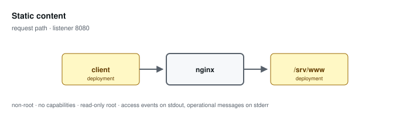

# Static content

**Status: preview / unqualified.** Tested, not supported. See the
[support matrix](../../SUPPORT.md).

Serves a read-only tree. Permits GET and implicit HEAD, rejects other methods, disables directory indexes, denies dot-prefixed path components, and answers 404 for absent content.

Configuration: [`examples/profiles/static/nginx.conf`](../../../examples/profiles/static/nginx.conf)

## Shared baseline

Like every profile, this one listens on an unprivileged port, exposes an
unlogged `/healthz`, runs as an arbitrary non-root UID in group 0 with all
capabilities dropped and a read-only root, sets `server_tokens off` with
bounded request handling, validates or replaces the inbound correlation
identifier, and emits one JSON access event per application request that
records the path and never the query string.

## What the tests qualify

- method restriction and dot-path denial
- absent content answers 404, not a directory listing
- structured access events with a validated correlation identifier
- restricted runtime on both architectures, Podman and Docker

## What they do not

- content integrity — the mounted tree is whatever the deployment mounts
- caching and compression behaviour
- throughput under load

## Related

- [Profile guide](../../CONFIGURATION-PROFILES.md#static) — full configuration detail and log schema
- [Profile map](../README.md#configuration-profiles) — how this profile relates to the others
- [Runtime contract](../README.md#runtime-contract) — the boundary every profile inherits
