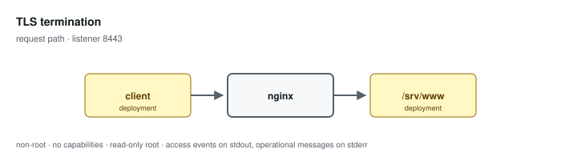

# TLS termination

**Status: preview / unqualified.** Tested, not supported. See the
[support matrix](../../SUPPORT.md).

Terminates TLS 1.2 and 1.3 using an operator-provided certificate and key mounted read-only.

Configuration: [`examples/profiles/tls-termination/nginx.conf`](../../../examples/profiles/tls-termination/nginx.conf)

## Shared baseline

Like every profile, this one listens on an unprivileged port, exposes an
unlogged `/healthz`, runs as an arbitrary non-root UID in group 0 with all
capabilities dropped and a read-only root, sets `server_tokens off` with
bounded request handling, validates or replaces the inbound correlation
identifier, and emits one JSON access event per application request that
records the path and never the query string.

## What the tests qualify

- TLS 1.2 and 1.3 accepted, TLS 1.1 rejected
- an untrusted chain is rejected
- leaf renewal is picked up
- no key material or client identity appears in any log

## What they do not

- production PKI operation and key custody
- renewal automation and alert delivery
- host cryptographic policy, which decides the available ciphers
- any FIPS claim

## Related

- [Profile guide](../../CONFIGURATION-PROFILES.md) — full configuration detail and log schema
- [Profile map](../README.md#configuration-profiles) — how this profile relates to the others
- [Runtime contract](../README.md#runtime-contract) — the boundary every profile inherits
