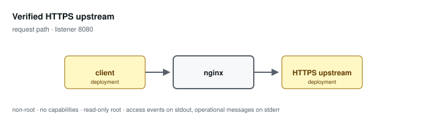

# Verified HTTPS upstream

**Status: preview / unqualified.** Tested, not supported. See the
[support matrix](../../SUPPORT.md).

Proxies to an HTTPS upstream with chain and hostname verification against a mounted trust store, and enforces a mounted revocation list.

Configuration: [`examples/profiles/tls-upstream/nginx.conf`](../../../examples/profiles/tls-upstream/nginx.conf)

## Shared baseline

Like every profile, this one listens on an unprivileged port, exposes an
unlogged `/healthz`, runs as an arbitrary non-root UID in group 0 with all
capabilities dropped and a read-only root, sets `server_tokens off` with
bounded request handling, validates or replaces the inbound correlation
identifier, and emits one JSON access event per application request that
records the path and never the query string.

## What the tests qualify

- chain and hostname are verified; an untrusted chain is refused
- a revoked upstream certificate is refused
- overlapping-CA rotation works without disabling verification

## What they do not

- deployment DNS and egress policy
- upstream PKI operation
- OCSP or revocation beyond a mounted CRL

## Related

- [Profile guide](../../CONFIGURATION-PROFILES.md) — full configuration detail and log schema
- [Profile map](../README.md#configuration-profiles) — how this profile relates to the others
- [Runtime contract](../README.md#runtime-contract) — the boundary every profile inherits
