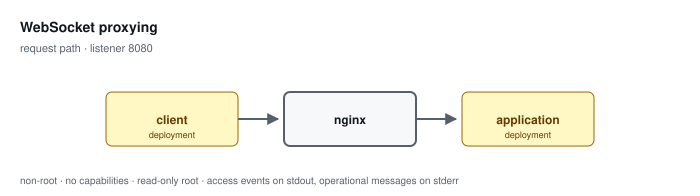

# WebSocket proxying

**Status: preview / unqualified.** Tested, not supported. See the
[support matrix](../../SUPPORT.md).

Proxies upgrade-capable traffic under /ws and ordinary HTTP elsewhere. The upstream connection disposition is derived from a map rather than copied from the client.

Configuration: [`examples/profiles/websocket/nginx.conf`](../../../examples/profiles/websocket/nginx.conf)

## Shared baseline

Like every profile, this one listens on an unprivileged port, exposes an
unlogged `/healthz`, runs as an arbitrary non-root UID in group 0 with all
capabilities dropped and a read-only root, sets `server_tokens off` with
bounded request handling, validates or replaces the inbound correlation
identifier, and emits one JSON access event per application request that
records the path and never the query string.

## What the tests qualify

- the upgrade token reaches the application and its 101 is relayed
- a conflicting client Connection header is not forwarded
- the plain HTTP location keeps ordinary timeouts

## What they do not

- frame exchange over an established session
- session duration and idle-timeout behaviour under real traffic
- concurrent session capacity
- Origin validation — not performed; see the profile guide

## Related

- [Profile guide](../../CONFIGURATION-PROFILES.md#websocket-proxying) — full configuration detail and log schema
- [Profile map](../README.md#configuration-profiles) — how this profile relates to the others
- [Runtime contract](../README.md#runtime-contract) — the boundary every profile inherits
